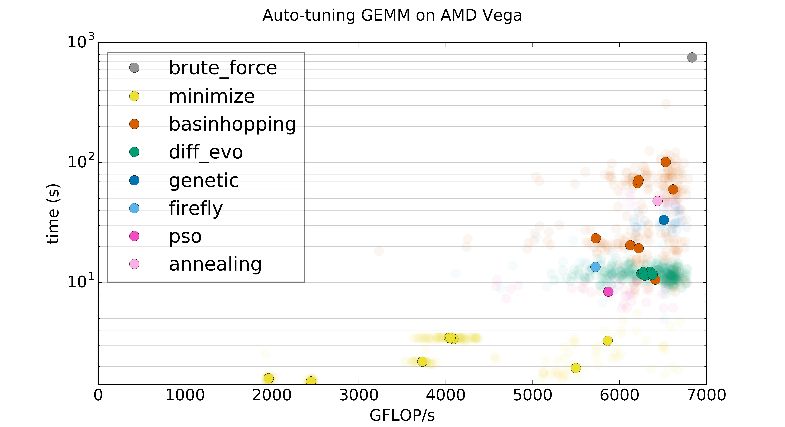

Kernel Tuner
============

|Build Status| |CodeCov Badge| |PyPi Badge| |Zenodo Badge| |SonarCloud Badge| |FairSoftware Badge|

Kernel Tuner simplifies the software development of optimized and auto-tuned GPU programs, by enabling Python-based unit testing of GPU code and making it easy to develop scripts for auto-tuning GPU kernels. This also means no extensive changes and no new dependencies are required in the kernel code. The kernels can still be compiled and used as normal from any host programming language.

Kernel Tuner provides a comprehensive solution for auto-tuning GPU programs, supporting auto-tuning of user-defined parameters in both host and device code, supporting output verification of all benchmarked kernels during tuning, as well as many optimization strategies to speed up the tuning process.

Documentation
-------------

The full documentation is available
`here <http://benvanwerkhoven.github.io/kernel_tuner/index.html>`__.

Installation
------------

The easiest way to install the Kernel Tuner is using pip:

To tune CUDA kernels:

- First, make sure you have the `CUDA Toolkit <https://developer.nvidia.com/cuda-toolkit>`_ installed
- Then type: ``pip install kernel_tuner[cuda]``

To tune OpenCL kernels:

- First, make sure you have an OpenCL compiler for your intended OpenCL platform
- Then type: ``pip install kernel_tuner[opencl]``

Or both:

- ``pip install kernel_tuner[cuda,opencl]``

More information about how to install Kernel Tuner and its
dependencies can be found in the `installation guide 
<http://benvanwerkhoven.github.io/kernel_tuner/install.html>`__

Example usage
-------------

The following shows a simple example for tuning a CUDA kernel:

.. code:: python

    kernel_string = """
    __global__ void vector_add(float *c, float *a, float *b, int n) {
        int i = blockIdx.x * block_size_x + threadIdx.x;
        if (i<n) {
            c[i] = a[i] + b[i];
        }
    }
    """

    size = 10000000

    a = numpy.random.randn(size).astype(numpy.float32)
    b = numpy.random.randn(size).astype(numpy.float32)
    c = numpy.zeros_like(b)
    n = numpy.int32(size)
    args = [c, a, b, n]

    tune_params = dict()
    tune_params["block_size_x"] = [32, 64, 128, 256, 512]

    tune_kernel("vector_add", kernel_string, size, args, tune_params)

The exact same Python code can be used to tune an OpenCL kernel:

.. code:: python

    kernel_string = """
    __kernel void vector_add(__global float *c, __global float *a, __global float *b, int n) {
        int i = get_global_id(0);
        if (i<n) {
            c[i] = a[i] + b[i];
        }
    }
    """

The Kernel Tuner will detect the kernel language and select the right compiler and 
runtime. For every kernel in the parameter space, the Kernel Tuner will insert C 
preprocessor defines for the tunable parameters, compile, and benchmark the kernel. The 
timing results will be printed to the console, but are also returned by tune_kernel to 
allow further analysis. Note that this is just the default behavior, what and how 
tune_kernel does exactly is controlled through its many `optional arguments 
<http://benvanwerkhoven.github.io/kernel_tuner/user-api.html#kernel_tuner.tune_kernel>`__.

You can find many - more extensive - example codes, in the
`examples directory <https://github.com/benvanwerkhoven/kernel_tuner/blob/master/examples/>`__
and in the `Kernel Tuner
documentation pages <http://benvanwerkhoven.github.io/kernel_tuner/index.html>`__.

Search strategies for tuning
----------------------------

Kernel Tuner supports many optimization algorithms to accelerate the auto-tuning process. Currently 
implemented search algorithms are: Brute Force (default), Nelder-Mead, Powell, CG, BFGS, L-BFGS-B, TNC, 
COBYLA, SLSQP, Random Search, Basinhopping, Differential Evolution, a Genetic Algorithm, Particle Swarm 
Optimization, the Firefly Algorithm, and Simulated Annealing.

Using a search strategy is easy, you only need to specify to ``tune_kernel`` which strategy and method 
you would like to use, for example ``strategy="genetic_algorithm"`` or ``strategy="basinhopping"``. 
For a full overview of the supported search strategies and methods please see the `user 
api documentation <http://benvanwerkhoven.github.io/kernel_tuner/user-api.html>`__.

Tuning host and kernel code
---------------------------

It is possible to tune for combinations of tunable parameters in
both host and kernel code. This allows for a number of powerfull things,
such as tuning the number of streams for a kernel that uses CUDA Streams
or OpenCL Command Queues to overlap transfers between host and device
with kernel execution. This can be done in combination with tuning the
parameters inside the kernel code. See the `convolution\_streams example
code <https://github.com/benvanwerkhoven/kernel_tuner/blob/master/examples/>`__
and the
`documentation <http://benvanwerkhoven.github.io/kernel_tuner/hostcode.html>`__
for a detailed explanation of the kernel tuner Python script.

Correctness verification
------------------------

Optionally, you can let the kernel tuner verify the output of every
kernel it compiles and benchmarks, by passing an ``answer`` list. This
list matches the list of arguments to the kernel, but contains the
expected output of the kernel. Input arguments are replaced with None.

.. code:: python

    answer = [a+b, None, None]  # the order matches the arguments (in args) to the kernel
    tune_kernel("vector_add", kernel_string, size, args, tune_params, answer=answer)

Contributing
------------

Please see the `Contributions Guide <http://benvanwerkhoven.github.io/kernel_tuner/contributing.html>`__.

Citation
--------
The paper about `Kernel Tuner is published (Open Access) <https://www.sciencedirect.com/science/article/pii/S0167739X18313359>`__, please cite
Kernel Tuner as follows:

.. code:: latex

    @article{kerneltuner,
      author  = {Ben van Werkhoven},
      title   = {Kernel Tuner: A search-optimizing GPU code auto-tuner},
      journal = {Future Generation Computer Systems},
      year = {2019},
      volume  = {90},
      pages = {347-358},
      doi = {https://doi.org/10.1016/j.future.2018.08.004},
    }

Related work
------------

You may also like `CLTune <https://github.com/CNugteren/CLTune>`__ by
Cedric Nugteren. CLTune is a C++ library for kernel tuning.

.. |Build Status| image:: https://github.com/benvanwerkhoven/kernel_tuner/actions/workflows/python-app.yml/badge.svg
   :target: https://github.com/benvanwerkhoven/kernel_tuner/actions/workflows/python-app.yml
.. |CodeCov Badge| image:: https://codecov.io/gh/benvanwerkhoven/kernel_tuner/branch/master/graph/badge.svg
   :target: https://codecov.io/gh/benvanwerkhoven/kernel_tuner
.. |PyPi Badge| image:: https://img.shields.io/pypi/v/kernel_tuner.svg?colorB=blue 
   :target: https://pypi.python.org/pypi/kernel_tuner/
.. |Zenodo Badge| image:: https://zenodo.org/badge/DOI/10.5281/zenodo.1220113.svg
   :target: https://doi.org/10.5281/zenodo.1220113
.. |SonarCloud Badge| image:: https://sonarcloud.io/api/project_badges/measure?project=benvanwerkhoven_kernel_tuner&metric=alert_status
   :target: https://sonarcloud.io/dashboard?id=benvanwerkhoven_kernel_tuner
.. |FairSoftware Badge| image:: https://img.shields.io/badge/fair--software.eu-%E2%97%8F%20%20%E2%97%8F%20%20%E2%97%8F%20%20%E2%97%8F%20%20%E2%97%8F-green
   :target: https://fair-software.eu
