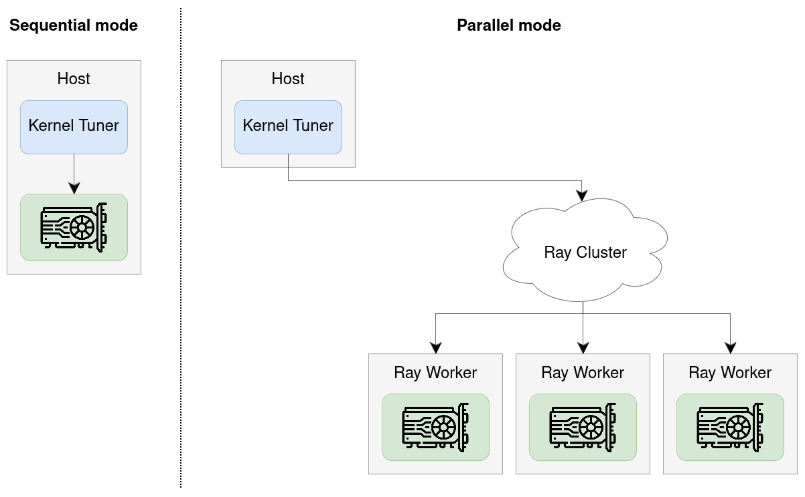

Parallel and Remote Tuning
==========================

By default, Kernel Tuner benchmarks GPU kernel configurations sequentially on a single local GPU.
While this works well for small tuning problems, it can become a bottleneck for larger search spaces.

Kernel Tuner also supports **parallel tuning**, allowing multiple GPUs to evaluate kernel configurations in parallel.
The same mechanism can be used for **remote tuning**, where Kernel Tuner runs on a host system while one or more GPUs are located on remote machines.

Parallel/remote tuning is implemented using `Ray <https://docs.ray.io/en/latest/>`_ and works on both local multi-GPU systems and distributed clusters.

How to use
----------

To enable parallel tuning, pass the ``parallel_workers`` argument to ``tune_kernel``:

.. code-block:: python

    kernel_tuner.tune_kernel(
        "vector_add",
        kernel_string,
        size,
        args,
        tune_params,
        parallel_workers=True,
    )

If ``parallel_workers`` is set to ``True``, Kernel Tuner will use all available Ray workers for tuning.
Alternatively, ``parallel_workers`` can be set to an integer ``n`` to use exactly ``n`` workers.

Parallel tuning and optimization strategies
-------------------------------------------

The achievable speedup from using multiple GPUs depends in part on the **optimization strategy** used during tuning.

Some optimization strategies support **maximum parallelism** and can evaluate all configurations independently.
Other strategies support **limited parallelism**, typically by repeatly evaluating a fixed-size population of configurations in parallel.
Finally, some strategies are **inherently sequential** and always evaluate configurations one by one, providing no parallelism.

The current optimization strategies can be grouped as follows:

* **Maximum parallelism**:
  ``brute_force``, ``random_sample``

* **Limited parallelism**:
  ``genetic_algorithm``, ``pso``, ``diff_evo``, ``firefly_algorithm``

* **No parallelism**:
  ``minimize``, ``basinhopping``, ``greedy_mls``, ``ordered_greedy_mls``,
  ``greedy_ils``, ``dual_annealing``, ``mls``,
  ``simulated_annealing``, ``bayes_opt``

Setting up Ray
--------------

Kernel Tuner uses `Ray <https://docs.ray.io/en/latest/>`_ to distribute kernel evaluations across multiple GPUs.
ay is an open-source framework for distributed computing in Python.

To use parallel tuning, you must first install Ray itself:

.. code-block:: bash

   $ pip install ray

Next, you must set up a Ray cluster.
Kernel Tuner will internally attempt to connect to an existing cluster by calling:

.. code-block:: python

   ray.init(address="auto")

Refer to the Ray documentation for details on how ``ray.init()`` connects to a local or remote cluster
(`documentation <https://docs.ray.io/en/latest/ray-core/api/doc/ray.init.html>`_).
For example, you can set the ``RAY_ADDRESS`` environment variable to point to the address of a remote Ray head node.
Alternatively, you may manually call ``ray.init(address="your_head_node_ip:6379")`` before calling ``tune_kernel``.

Here are some common ways to set up your cluster:

Local multi-GPU machine
***********************

By default, on a machine with multiple GPUs, Ray will start a temporary local cluster and automatically detect all available GPUs.
Kernel Tuner can then use these GPUs in parallel for tuning.

Distributed cluster with SLURM (easy, Ray ≥2.49)
************************************************

The most straightforward way to use Ray on a SLURM cluster is to use the ``ray symmetric-run`` command, available from Ray **2.49** onwards.
This launches a Ray environment, runs your script, and then shuts it down again.

Consider the following script ``launch_ray.sh``.

.. literalinclude:: launch_ray.sh
   :language: bash

Next, run your Kernel Tuner script using ``srun``.
The exact command depends on your cluster.
In the example below, ``-N4`` indicates 4 nodes and ``--gres=gpu:1`` indicates 1 GPU per node.

.. code-block:: bash

   $ srun -N4 --gres=gpu:1 launch_ray.sh python3 my_tuning_script.py

Distributed Cluster with SLURM (manual, Ray <2.49)
**************************************************

An alternative way to use Ray on SLURM is to launch a Ray cluster, obtain the IP address of the head node, and the connect to it remotely.

Consider the following sbatch script ``submit_ray.sh``.

.. literalinclude:: submit_ray.sh
   :language: bash

Next, submit your job using ``sbatch``.

.. code-block:: bash

   $ sbatch submit_ray.sh
   Submitted batch job 1223577

After this, inspect the file `slurm-1223577.out` and search for the following line:

.. code-block::

   $ grep RAY_ADDRESS slurm-1223577.out
   Launching head node: RAY_ADDRESS=145.184.221.164:6379

Finally, launch your application using:

.. code-block::

   RAY_ADDRESS=145.184.221.164:6379 python my_tuning_script.py
